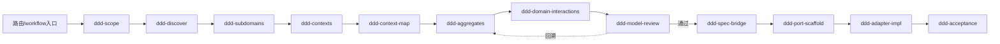
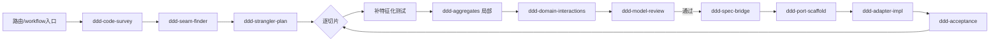
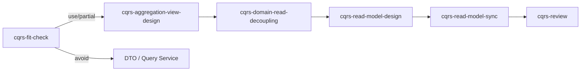
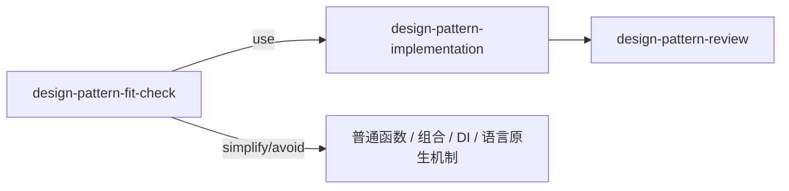

# backend-best-practices

> 把一套开发方法论从"靠资深架构师的经验"，变成"Agent 可重复执行、可门禁、可回溯"的工序插件——**SKILL 纯能力、WORKFLOW 统筹、COMMAND 薄入口**三层分明。

> 改造自 `domain-driven-design` 母体：当前保留 DDD 建模链路，并新增 **CQRS Read Model / 业务聚合视图** 与 **Design Patterns / 多语言模式实现** 能力，用最小复杂度保护 Domain、解耦查询展示，并把高品质设计经验固化成常驻能力。

---

## 三层架构（职责严格互斥）

| 层 | 职责 | 位置 |
| :--- | :--- | :--- |
| **SKILL** | **纯能力**：做什么 / 需要什么参数 / 怎么做 / 返回什么。零上下游、零阶段、零回溯、零编排——一个纯函数。 | `skills/*/SKILL.md` |
| **WORKFLOW** | **唯一统筹者**：把 SKILL 整合成开发流程，工件**经文件交接**（编号工件 + `_manifest`），门禁与回溯只在这里。 | `workflows/*.md` |
| **COMMAND** | **薄入口**：解析参数、启动一条 workflow 或调用一个 skill，不含逻辑。 | `commands/*.md` |

> 完整契约（SKILL 四段模板、文件交接协议、两级自检）见 [`docs/ARCHITECTURE.md`](docs/ARCHITECTURE.md)。

### 两级自检

- **① SKILL 返回格式自检**：产出是否符合自己声明的返回格式（字段齐、形状对）。SKILL 只对自己负责。
- **② WORKFLOW 门禁**：产出是否满足流程需求（量化阈值、完整性、放行/回溯）。SKILL 不掺和。

---

## 能力（纯能力，按认知阶段归类）

`ddd-mode-router` 已**下沉为 workflow 入口的路由步骤**，不再是 skill。能力全清单与 I/O 见 [`docs/CAPABILITIES.md`](docs/CAPABILITIES.md)。

| 阶段（category）| 能力 |
| :--- | :--- |
| discovery | `ddd-scope` / `ddd-discover` |
| strategic | `ddd-subdomains` / `ddd-contexts` / `ddd-context-map` |
| tactical | `ddd-aggregates` / `ddd-domain-interactions` |
| validation | `ddd-model-review` |
| specification | `ddd-spec-bridge` |
| implementation | `ddd-port-scaffold` / `ddd-adapter-impl` / `ddd-acceptance` |
| reverse（改造）| `ddd-code-survey` / `ddd-seam-finder` / `ddd-strangler-plan` |
| query/read-model | `cqrs-fit-check` / `cqrs-domain-read-decoupling` / `cqrs-aggregation-view-design` / `cqrs-read-model-design` / `cqrs-read-model-sync` |
| validation | `cqrs-review` |
| design-patterns | `design-pattern-fit-check` / 23 个 `design-pattern-<pattern>` 独立模式能力 / `design-pattern-implementation` |
| validation | `design-pattern-review` |

每个能力目录含 `SKILL.md`（默认加载的纯能力四段）+ 按需加载的附加文件（`examples.md` 等）。

---

## 工作流

两条链路在 workflow 入口路由分叉，在**局部战术建模处汇流**复用同一批纯能力。workflow 独占顺序、文件交接、门禁、回溯。

### A. Greenfield（0→1 新建）



### B. Brownfield（既有项目改造）



文件交接与门禁细节见 [`workflows/workflow-greenfield.md`](workflows/workflow-greenfield.md) / [`workflows/workflow-brownfield.md`](workflows/workflow-brownfield.md)。

### C. CQRS Read Model（读模型/聚合视图）



文件交接与门禁细节见 [`workflows/workflow-read-model-greenfield.md`](workflows/workflow-read-model-greenfield.md)、[`workflows/workflow-read-model-brownfield.md`](workflows/workflow-read-model-brownfield.md)、[`workflows/workflow-read-model-review.md`](workflows/workflow-read-model-review.md)。

### D. System Model + View Reading（既有系统深度读码）

```mermaid
flowchart LR
  CS[ddd-code-survey] --> EV[ddd-discover]
  EV --> SD[ddd-subdomains] --> CX[ddd-contexts] --> CM[ddd-context-map]
  CM --> AG[ddd-aggregates] --> DI[ddd-domain-interactions] --> MR[ddd-model-review]
  MR --> DR[cqrs-domain-read-decoupling] --> AV[cqrs-aggregation-view-design]
  AV --> RM[cqrs-read-model-design] --> SY[cqrs-read-model-sync] --> RV[cqrs-review]
  RV --> REPORT[system-reading-report]
```



用于把当前系统代码解释成业务模型、领域边界、聚合行为、业务视图、读模型和刷新策略。细节见 [`workflows/workflow-system-model-view-read.md`](workflows/workflow-system-model-view-read.md)。

### E. Design Pattern（设计模式选择/实现/审查）



按 GoF 三大类整理创建型、结构型、行为型全部 23 个模式，每个模式都是独立 SKILL，且每个目录包含 `language-differences.md` 与 `examples.md` 附件。具体模式默认输出 Markdown 设计说明；需要 workflow 串接时才追加可选 `structured_summary`。落地时保持语言无关：先判断变化轴，再路由到具体模式能力，最后按 Java / TypeScript / Python / Go / C# / Kotlin / Rust 等语言生成惯用实现。细节见 [`workflows/workflow-design-pattern.md`](workflows/workflow-design-pattern.md)、[`references/design-pattern-catalog.md`](references/design-pattern-catalog.md)。

---

## 命令（薄入口）

| 命令 | 动作 |
| :--- | :--- |
| `/backend-best-practices:ddd-new <描述>` | 启动 `workflow-greenfield` |
| `/backend-best-practices:ddd-refactor <代码路径>` | 启动 `workflow-brownfield` |
| `/backend-best-practices:ddd-review <工件>` | 调用 `ddd-model-review` |
| `/backend-best-practices:ddd-spec <战术工件>` | 调用 `ddd-spec-bridge` |
| `/backend-best-practices:ddd-scaffold <规范> --lang=<语言>` | 调用 `ddd-port-scaffold` |
| `/backend-best-practices:cqrs-read-model-new <需求>` | 启动 `workflow-read-model-greenfield` |
| `/backend-best-practices:cqrs-read-model-refactor <代码路径或现状>` | 启动 `workflow-read-model-brownfield` |
| `/backend-best-practices:cqrs-read-model-review <工件>` | 启动 `workflow-read-model-review` |
| `/backend-best-practices:system-model-view-read <代码路径>` | 启动 `workflow-system-model-view-read` |
| `/backend-best-practices:design-pattern <设计问题或代码路径> --lang=<语言>` | 启动 `workflow-design-pattern` |
| `/backend-best-practices:design-pattern-<pattern> <设计问题或代码路径> --lang=<语言>` | 固定某个 GoF 模式并启动 `workflow-design-pattern` |

---

## 接口优先 = 语言无关

落地层分三步保持语言无关：`ddd-spec-bridge` 产出语言中立端口契约 → `ddd-port-scaffold` 按**语言剖面**实例化接口骨架 → `ddd-adapter-impl` 在接口背后实现。设计模式也先产出语言无关角色/协作蓝图，再按目标语言惯用机制实现，避免把 Java 类图强绑定到所有语言。语言剖面映射见 [`references/language-profiles.md`](references/language-profiles.md)、[`references/design-pattern-language-profiles.md`](references/design-pattern-language-profiles.md)。

---

## 目录结构

```
backend-best-practices/
├── .claude-plugin/plugin.json     插件清单
├── README.md                      本文（三层架构与工序骨架）
├── docs/
│   ├── ARCHITECTURE.md            三层契约 + 文件交接协议 + 两级自检（真源）
│   └── CAPABILITIES.md            能力纯 I/O 清单
├── skills/                        纯能力（SKILL.md + 按需附加文件）
├── commands/                      薄入口
├── workflows/                     workflow（统筹 + 文件交接）
├── examples/                      CQRS 读模型示例
└── references/
    ├── language-profiles.md       语言剖面映射表
    ├── design-pattern-catalog.md  GoF 23 个设计模式总览
    ├── design-pattern-language-profiles.md 多语言模式落地剖面
    └── *read-model*.md            CQRS 读模型参考
```

---

## 溯源

改造自 [`domain-driven-design`](https://github.com/Capsule7446/Domain-Driven-Design) 母体，重构为"SKILL 纯能力 / WORKFLOW 文件交接统筹 / COMMAND 薄入口"三层分离架构。
