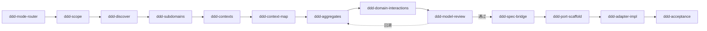
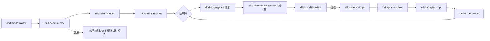

# backend-best-practices

> 把 DDD（领域驱动设计）从"靠资深架构师的经验"变成"Agent 可重复执行、可串联、可回溯、可落地到任意面向接口语言"的开发流程插件。

一套面向 Claude Code 与 Cowork 的 DDD 工序集：支持 **0→1 新建（greenfield）** 与 **既有项目改造（brownfield）** 两条驱动，从一句模糊的业务诉求一路推到 **接口优先、语言无关** 的可运行代码。全程可门禁、可回溯。

---

## 它解决什么问题

事件风暴、上下文映射、聚合设计……DDD 的方法论威力很大，却高度依赖经验丰富的架构师——难以标准化、难以交接、难以让 Agent 稳定复现。

本插件把这套方法论固化成一串带**退出门禁**的结构化工序：

- 每一步都有明确的 **输入 / 流程 / 产出 / 校验清单**；
- 上一步的产出能**直接当作**下一步的输入；
- 校验不过则按**量化条件自动回溯**到对应上游。

> **核心一句话**：每个 Skill = 一段面向 LLM 的、带退出门禁的结构化 SOP——不是被动检索的知识库，而是主动执行的"建模工序"。

### 三条设计原则

1. **接口契约统一**——每个 `SKILL.md` 含固定七段，保证工件可衔接、可门禁。
2. **双向闭环**——阶段间非线性，验证阶段可按量化条件触发回溯（如"不变量表达率 < 60% → 回退聚合设计"）。
3. **接口优先即语言无关**——落地层先产出语言中立的端口契约，再经"语言剖面"实例化为任意面向接口语言（Java / Go / TS / Python / C# / Rust / Kotlin / …）。换语言 = 换剖面，建模工件零改动。

---

## 快速上手

```text
# 全新系统
/backend-best-practices:ddd-new 我们要做一个会议室预订系统，支持冲突检测和审批 --lang=ts

# 改造既有系统
/backend-best-practices:ddd-refactor src/order-monolith --goal=拆分 --lang=java

# 只给现有模型做体检
/backend-best-practices:ddd-review docs/model/
```

命令会先经 `backend-best-practices:ddd-mode-router` 确认驱动类型，再按对应 workflow 逐阶段推进，并在关键门禁（战略边界、模型验证、落地）停下与你确认。

---

## 工作原理

### 三层架构

| 层 | 是什么 | 放在哪 |
| :--- | :--- | :--- |
| **SKILL** | 原子工序（一次推理、一份结构化工件）——建模与落地的积木 | `skills/*/SKILL.md` |
| **COMMAND** | 薄入口（斜杠命令，带参数）——一键触发某个 Skill 或一段序列 | `commands/*.md` |
| **WORKFLOW** | 编排（按门禁串联多个 Skill，含回溯）——承载两种驱动的完整链路 | `workflows/*.md` |

### 六个阶段（认知模式）

建模不是线性的，而是按"认知模式"推进、可回溯的六个阶段（阶段 0 为统一入口路由）：

| 阶段 | 名称 | 认知模式 | 关键问题 |
| :--- | :--- | :--- | :--- |
| 0 | 模式路由 Routing | 决策 | 这是新建还是改造？已知什么？从哪进？ |
| I | 问题空间发现 Discovery | 发散 | 在解决什么问题？领域里发生了什么？ |
| II | 战略建模 Strategic | 分解 | 怎么切分？边界在哪？语言怎么统一？ |
| III | 战术建模 Tactical | 精确设计 | 边界内的构造块是什么？怎么协作？ |
| IV | 模型验证 Validation | 批判 | 模型一致、完整、可实现吗？ |
| V | 规范衔接 Specification | 转换 | 怎样变成语言中立的接口契约规范？ |
| VI | 接口落地 Implementation | 生成 | 怎样在目标语言里以接口优先实现？ |

### 16 个 Skill（按阶段）

| 阶段 | Skill | 职责 |
| :--- | :--- | :--- |
| 0 路由 | `ddd-mode-router` | 判定驱动类型、采集上下文、选入口 |
| I 发现 | `ddd-scope` / `ddd-discover` | 范围收敛 / 事件风暴 |
| II 战略 | `ddd-subdomains` / `ddd-contexts` / `ddd-context-map` | 子域分类 / 限界上下文 / 上下文映射 |
| III 战术 | `ddd-aggregates` / `ddd-domain-interactions` | 不变量→聚合 / 接口语义化 |
| IV 验证 | `ddd-model-review` | 质量门禁 + 回溯 |
| V 规范 | `ddd-spec-bridge` | 语言中立接口契约规范 |
| VI 落地 | `ddd-port-scaffold` / `ddd-adapter-impl` / `ddd-acceptance` | 接口骨架 / 实现+适配器 / 验收 |
| 改造 | `ddd-code-survey` / `ddd-seam-finder` / `ddd-strangler-plan` | 逆向建模 / 接缝识别 / 绞杀者迁移 |

---

## 两条工作流

两条链路在 `ddd-mode-router` 分叉，在**阶段 III（战术）之后汇流**到同一套 validation → spec → 落地。改造驱动的独特性只在前段（逆向建模 + 迁移规划）；一旦定位到要改的切片，用的就是和新建一样的战术建模与接口优先落地——最大化复用，避免维护两套战术 Skill。

### A. Greenfield（0→1 新建）



从问题空间一路推到可运行代码；每个门禁不过则回溯；落地三步（端口 → 适配 → 验收）严格走接口优先。

### B. Brownfield（既有项目改造）



**先逆向后正向**：先用 `code-survey` 从代码反推现状模型，`seam-finder` 找防腐层落点，`strangler-plan` 排迁移批次；然后**逐切片**复用建模主干，每切片落地前先补特征化测试（characterization test）兜底，再以接口优先替换实现。绞杀者模式保证旧系统始终可运行、可回滚。

---

## 命令清单

| 命令 | 作用 |
| :--- | :--- |
| `/backend-best-practices:ddd-new <业务描述>` | 启动 0→1 新建全链路 |
| `/backend-best-practices:ddd-refactor <代码路径>` | 启动既有项目改造 |
| `/backend-best-practices:ddd-review <建模工件>` | 给现有模型做质量体检 |
| `/backend-best-practices:ddd-spec <战术工件>` | 导出语言中立接口契约规范 |
| `/backend-best-practices:ddd-scaffold <上下文> --lang=<语言>` | 按语言剖面生成接口骨架 |

---

## 接口优先 = 语言无关（核心机制）

这是全体系最关键的增量。要"适配所有面向接口开发的语言"又不为每种语言维护一套模板，把落地拆成三步：

**1. `ddd-spec-bridge` 产出语言中立的端口契约**——只有方法签名 + 语义契约（前置/后置/事务/不变量），零语言绑定：

```
Port: OrderRepository
  - findById(orderId: OrderId) -> Order | null    [查询边界: 单聚合]
  - save(order: Order) -> void                     [事务: 1 聚合/1 事务]
Invariant: 订单确认后行项不可修改
```

**2. `ddd-port-scaffold` 读取"语言剖面"**，把契约翻译成目标语言的接口构造：

| 中立构造 | Java | Go | TypeScript | Python | C# | Rust | Kotlin |
| :--- | :--- | :--- | :--- | :--- | :--- | :--- | :--- |
| 端口/接口 | `interface` | `interface` | `interface` | `Protocol`/`ABC` | `interface` | `trait` | `interface` |
| 值对象 | `record` | `struct`(值语义) | `readonly type` | `@dataclass(frozen)` | `record struct` | `struct`+`#[derive]` | `data class` |
| 不可变 | `final` | 无 setter | `readonly` | `frozen=True` | `init`-only | 默认不可变 | `val` |
| 依赖注入 | 构造器注入 | 显式传参 | 构造器注入 | `Depends`/构造器 | DI 容器 | 显式传参 | 构造器注入 |

完整映射见 [`references/language-profiles.md`](references/language-profiles.md)。

**3. `ddd-adapter-impl` 在接口背后实现**——领域层只依赖接口，基础设施实现接口。换语言 = 换剖面，**领域契约与建模工件零改动**。这正是六边形架构 ports & adapters 的本质：领域依赖抽象，永不依赖具体。

---

## 工程约定

### 统一 `SKILL.md` 接口契约

每个 `ddd-*` 的 `SKILL.md` 都遵守同一接口契约，这是"工件可衔接、可门禁"的命脉。frontmatter：

```yaml
---
name: ddd-<skill-name>
description: "<一句话：做什么 + 何时触发>"
risk: safe
stage: <router|discovery|strategic|tactical|validation|specification|implementation|refactor>
driver: <both|greenfield|brownfield>
source: self
tags: "[ddd, <stage>, <focus>]"
---
```

正文固定七段（顺序固定）：**使用时机 / 输入要求 / 流程 / 输出 / 校验清单 / 回溯触发 / 示例**。只要所有 Skill 都遵守这个契约，上一阶段的产出就能直接喂进下一阶段。

### 目录结构

```
domain-driven-design/
├── .claude-plugin/plugin.json     插件清单
├── README.md                      本文（含体系蓝图、流程图、设计依据）
├── skills/                        16 个 Skill（六阶段 + 改造驱动）
├── commands/                      5 个斜杠命令
├── workflows/                     2 条 workflow（greenfield / brownfield）
└── references/
    └── language-profiles.md       语言剖面映射表（落地层语言无关的核心）
```

---

## 设计依据

本体系把三个代表性 DDD Skill 仓库的优点合到一起，并补上各自的缺口：

| 参考仓库 | 它擅长什么 | 本体系如何取舍 |
| :--- | :--- | :--- |
| **ForceInjection/domain-driven-design-skills** | 完整建模流程 + 统一接口契约 + 回溯闭环（语言无关，但止步于规范） | **以它的七段接口契约为骨架**，建模主干直接继承 |
| **pwyczes/ddd-ai-skills-applied** | 战术模式单点重构（triage→实现→验证，可作用于既有代码） | 启发**把"既有项目改造"做成独立驱动**：逆向建模 + 接缝识别 + 绞杀者迁移 |
| **iktakahiro/python-fastapi-ddd-skill** | 可直接生成可运行代码 + 配套工程命令（但强绑 Python/FastAPI） | 反面教材：**落地层去语言耦合**，改用"接口优先 + 语言剖面" |

四条核心取舍：① 继承 ForceInjection 的七段接口契约（可串联、可门禁）；② 把"两种驱动"做成一等公民（brownfield 补逆向建模/接缝/绞杀者）；③ 语言无关 = 接口优先（ports & adapters）+ 语言剖面；④ SKILL / COMMAND / WORKFLOW 三层各司其职。

来源：

- [ForceInjection/domain-driven-design-skills](https://github.com/ForceInjection/domain-driven-design-skills)
- [pwyczes/ddd-ai-skills-applied](https://github.com/pwyczes/ddd-ai-skills-applied)
- [iktakahiro/python-fastapi-ddd-skill](https://github.com/iktakahiro/python-fastapi-ddd-skill)
- [ddd-crew/ddd-starter-modelling-process](https://github.com/ddd-crew/ddd-starter-modelling-process)（流程回溯依据）
